<picture>
  <source media="(prefers-color-scheme: dark)" srcset="./assets/hero-dark.svg">
  <source media="(prefers-color-scheme: light)" srcset="./assets/hero-light.svg">
  
</picture>

  
  
  
  

## About

Senior DevOps Engineer with 4+ years across cloud infrastructure, Kubernetes, delivery automation, and observability. At **Geniebook** I operate six EKS and TKE clusters across production, staging, and development, and led a cloud consolidation of 30+ production services.

I connect infrastructure decisions to operational outcomes — lower cloud spend, repeatable deployments, clearer incident signals — and I'm building **human-governed AI agents** for infrastructure and incident operations.

| Cloud & platform engineering | Reliability & delivery | Human-governed AI operations |
| :-- | :-- | :-- |
| Reusable infrastructure, Kubernetes operations, and consistent environments across the delivery lifecycle. | Actionable telemetry, safer release workflows, and ownership from deployment to incident response. | Grounded investigation, policy-evaluated remediation, and explicit human approval for production changes. |
| `Kubernetes` `Terraform` `Terragrunt` `Helm` | `SLI / SLO` `GitOps` `Grafana` `OpenTelemetry` | `LangGraph` `Temporal` `MCP` `OPA` |

<picture>
  <source media="(prefers-color-scheme: dark)" srcset="./assets/impact-dark.svg">
  <source media="(prefers-color-scheme: light)" srcset="./assets/impact-light.svg">
  
</picture>

## Open source

<table>
  <tr>
    <td width="50%" valign="top">
      <h3><a href="https://github.com/faridlamaul/omp-cost">omp-cost</a></h3>
      
Terminal FinOps utility for AI token usage, prompt-cache efficiency, cost attribution, and forecasts across Oh My Pi profiles — with TUI, JSON, CSV, and Markdown output.

      
<code>Go</code> <code>SQLite</code> <code>Cobra</code> <code>Lipgloss</code>

    </td>
    <td width="50%" valign="top">
      <h3><a href="https://github.com/faridlamaul/go-gitops">go-gitops</a></h3>
      
GitHub-focused CLI that turns Conventional Commits into semantic versions, structured release notes, and GitHub Releases, with a dry-run mode for review.

      
<code>Go</code> <code>GitHub API</code> <code>GitOps</code>

    </td>
  </tr>
  <tr>
    <td width="50%" valign="top">
      <h3><a href="https://github.com/faridlamaul/ci-template">ci-template</a></h3>
      
Reusable <code>workflow_call</code> GitHub Actions for semantic releases, Go / Node.js / Python CI, Go release packaging, and multi-platform Docker builds to GHCR.

      
<code>GitHub Actions</code> <code>CI/CD</code> <code>DevSecOps</code>

    </td>
    <td width="50%" valign="top">
      <h3><a href="https://github.com/faridlamaul/application-chart">application-chart</a></h3>
      
Values-driven Helm chart for APIs, workers, StatefulSets, Jobs, and CronJobs — with HPA, PDB, NetworkPolicy, ServiceMonitor, ExternalSecrets, and schema-validated values.

      
<code>Kubernetes</code> <code>Helm</code> <code>GitOps</code>

    </td>
  </tr>
</table>

## Building now

<picture>
  <source media="(prefers-color-scheme: dark)" srcset="./assets/flow-dark.svg">
  <source media="(prefers-color-scheme: light)" srcset="./assets/flow-light.svg">
  
</picture>

An **agentic SRE platform**: agents gather metrics, logs, recent changes, and runbooks, then prepare policy-evaluated actions. People keep authority over every production change.

## Toolbox

<picture>
  <source media="(prefers-color-scheme: dark)" srcset="https://skillicons.dev/icons?i=kubernetes%2Cdocker%2Caws%2Cgcp%2Cazure%2Clinux%2Cterraform%2Cansible%2Cgithubactions%2Cgitlab%2Cjenkins%2Cprometheus%2Cgrafana%2Cgo%2Cpython%2Cbash%2Cpostgres%2Cmysql%2Ckafka%2Cgit&perline=10&theme=dark">
  <source media="(prefers-color-scheme: light)" srcset="https://skillicons.dev/icons?i=kubernetes%2Cdocker%2Caws%2Cgcp%2Cazure%2Clinux%2Cterraform%2Cansible%2Cgithubactions%2Cgitlab%2Cjenkins%2Cprometheus%2Cgrafana%2Cgo%2Cpython%2Cbash%2Cpostgres%2Cmysql%2Ckafka%2Cgit&perline=10&theme=light">
  
</picture>

| Area | Tools |
| :-- | :-- |
| **Platforms** | AWS · GCP · Azure · Tencent Cloud · Kubernetes · Docker · Helm |
| **Delivery** | Terraform · Terragrunt · Helmfile · Ansible · GitLab CI/CD · GitHub Actions · Argo CD · Jenkins |
| **Reliability** | Prometheus · Grafana · Victoria Metrics · Datadog · Loki · OpenSearch · OpenTelemetry |
| **AI operations** | LangGraph · MCP · RAG · Temporal · OPA · Langfuse |
| **Security** | IAM · RBAC · Trivy · Gitleaks · SonarQube · DefectDojo |
| **Data & backend** | Go · Python · Bash · PostgreSQL · MySQL · Kafka · Debezium · Airflow |

## GitHub activity

  <picture>
    <source media="(prefers-color-scheme: dark)" srcset="https://github-readme-stats-eight-theta.vercel.app/api?username=faridlamaul&show_icons=true&include_all_commits=true&count_private=true&hide_border=true&border_radius=16&bg_color=0b0e0c&title_color=c4f078&icon_color=c4f078&text_color=a4afa6&ring_color=c4f078">
    <source media="(prefers-color-scheme: light)" srcset="https://github-readme-stats-eight-theta.vercel.app/api?username=faridlamaul&show_icons=true&include_all_commits=true&count_private=true&hide_border=true&border_radius=16&bg_color=f5f5ef&title_color=416218&icon_color=416218&text_color=52604f&ring_color=416218">
    
  </picture>
  <picture>
    <source media="(prefers-color-scheme: dark)" srcset="https://github-readme-streak-stats.herokuapp.com/?user=faridlamaul&hide_border=true&border_radius=16&background=0b0e0c&ring=c4f078&fire=c4f078&currStreakNum=f2f4ed&sideNums=f2f4ed&currStreakLabel=c4f078&sideLabels=a4afa6&dates=929e95&stroke=263028">
    <source media="(prefers-color-scheme: light)" srcset="https://github-readme-streak-stats.herokuapp.com/?user=faridlamaul&hide_border=true&border_radius=16&background=f5f5ef&ring=416218&fire=416218&currStreakNum=1b241b&sideNums=1b241b&currStreakLabel=416218&sideLabels=52604f&dates=586853&stroke=d2d9cb">
    
  </picture>

## Let's connect

Open to conversations about **cloud platform architecture**, **site reliability engineering**, **FinOps**, and **human-governed AI operations**. Reach me by [email](mailto:lamaulfarid71@gmail.com) or on [LinkedIn](https://www.linkedin.com/in/faridlamaul/).
